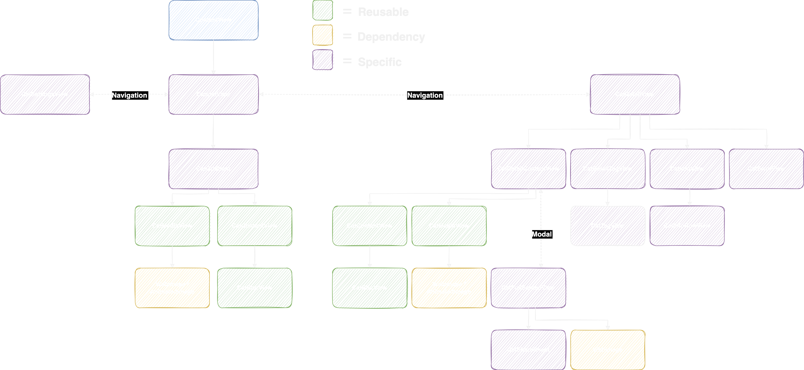
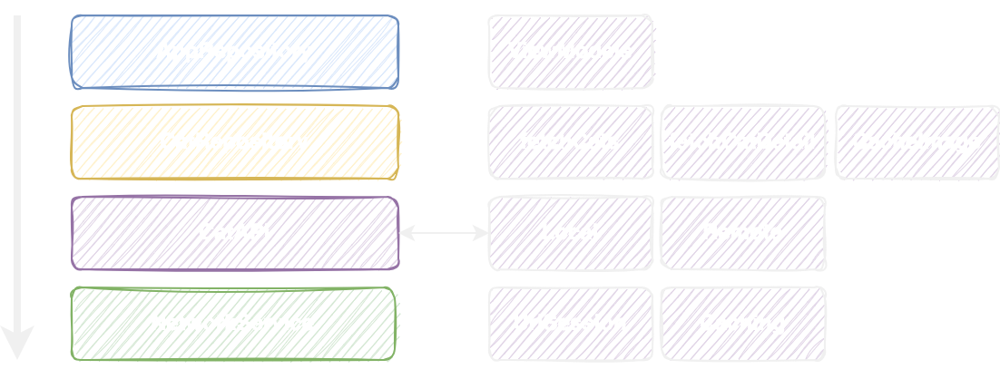
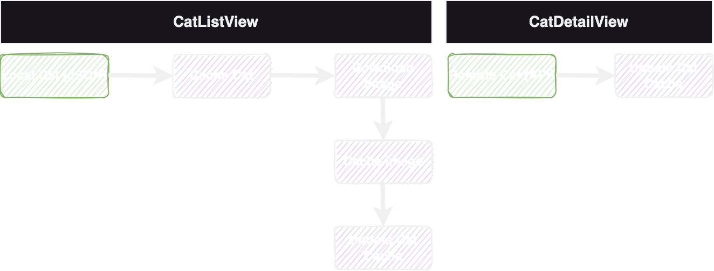
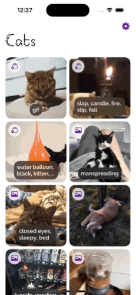
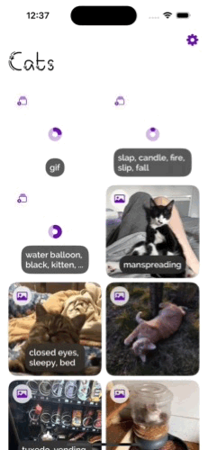
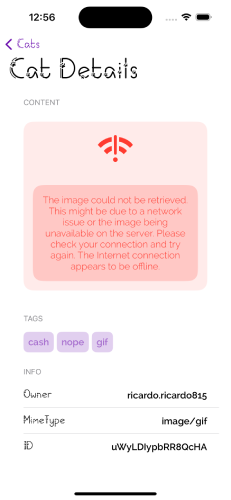

# Snapcat

Snapcat is a SwiftUI app that demonstrates various features of the Cat as a Service (CaaS) API. It was created to showcase my skills for EXSquared as part of a home assignment for applying to a Mid/Senior iOS role.

# Table of Contents

1. [Snapcat](#snapcat)
2. [View Hierarchy](#view-hierarchy)
3. [Model](#model)
   - [Cat](#cat)
   - [CatRealm](#catrealm)
4. [MVVM](#mvvm)
5. [Networking](#networking)
   - [CatRepository](#catrepository)
   - [CatAPI](#catapi)
   - [CatLocalService: CatAPI](#catlocalservice-catapi)
   - [CatAPIService: CatAPI](#catapiservice-catapi)
   - [AppRepository](#apprepository)
   - [Usage in ViewModels](#usage-in-viewmodels)
6. [Caching](#caching)
7. [Dependencies](#dependencies)
8. [Setup Instructions](#setup-instructions)
9. [What's New (v1.1)](#whats-new-v11)
   - [Code Reusability](#code-reusability)
     - [Code Structure and Modularity](#code-structure-and-modularity)
     - [Actions Taken](#actions-taken)
   - [Protocols and Delegation](#protocols-and-delegation)
     - [Actions Taken](#actions-taken-1)
   - [UI/UX Design](#uiux-design)
     - [Accessibility Enhancements](#accessibility-enhancements)
     - [Actions Taken](#actions-taken-2)
     - [Consistent Theming](#consistent-theming)
     - [Actions Taken](#actions-taken-3)
   - [Performance Optimization](#performance-optimization)
     - [Caching](#caching-1)
     - [Actions Taken](#actions-taken-4)
   - [Testing](#testing)
     - [Expand Test Coverage](#expand-test-coverage)
     - [Actions Taken](#actions-taken-5)
   - [Documentation](#documentation)
     - [Detailed README](#detailed-readme)
     - [Actions Taken](#actions-taken-6)
   - [Advanced Features](#advanced-features)
     - [Offline Support](#offline-support)
     - [Actions Taken](#actions-taken-7)
     - [Analytics](#analytics)
     - [Actions Taken](#actions-taken-8)
   - [User Feedback](#user-feedback)
     - [Loading Indicators and Error Messages](#loading-indicators-and-error-messages)
     - [Actions Taken](#actions-taken-9)


## View Hierarchy 


## Model

### Cat

```swift
struct Cat: Identifiable, Equatable {
	let id: String
	let tags: [String]?
	let owner: String?
	let createdAt: Date?
	let updatedAt: Date?
	let mimeType: String?
	let size: Int?
	let cachedFileName: String?
                    ... ... ...
```

### CatRealm

```swift
class CatRealm: Object {
	@Persisted(primaryKey: true) var id: String
	@Persisted var tagsString: String = ""
	@Persisted var owner: String?
	@Persisted var createdAt: Date?
	@Persisted var updatedAt: Date?
	@Persisted var mimeType: String?
	@Persisted var size: Int?
	@Persisted var cachedFileName: String?
                                ... ... ...
```

## MVVM

- CatListViewModel: CatListViewModelProtocol
    - CatListView
- CatDetailViewModel: CatDetailViewModelProtocol
    - CatDetailView
- CatGridItemViewModel: CatGridItemViewModelProtocol
    - CatGridItemView
- CatMediaViewModel: CatMediaViewModelProtocol
    - CatMediaView
- CatDetailContentViewModel: CatDetailContentViewModelProtocol
    - CatDetailContentView
- CatDetailTagViewModel: CatDetailTagViewModelProtocol
    - CatDetailTagView
- CatInfoViewModel: CatInfoViewModelProtocol
    - CatInfoView
- CatErrorViewModel: CatErrorViewModelProtocol
    - CatErrorView
- CatFullScreenViewModel: CatFullScreenViewModelProtocol
    - CatFullScreenView
- CatTagViewModel: CatTagViewModelProtocol
    - CatTagView
- CatInfoRowViewModel: CatInfoRowViewModelProtocol
    - CatInfoRowView
- CatContentViewModel: CatContentViewModelProtocol
    - CatContentView
- CatSettingsViewModel: CatSettingsViewModelProtocol
    - CatSettingsView

## Networking


### CatRepository

```swift
protocol CatRepository {
	func fetchCats() -> AnyPublisher<[Cat], NetworkError>
	func fetchCatDetail(id: String) -> AnyPublisher<Cat, NetworkError>
	func cacheImage(for cat: Cat, data: Data, completion: @escaping () -> Void)
}

class CatRepositoryImpl: CatRepository {
	private let localService: CatAPI
	private let apiService: CatAPI
	private let realm: Realm
	private var cancellables = Set<AnyCancellable>()

	init(localService: CatAPI, apiService: CatAPI, realm: Realm) {
		self.localService = localService
		self.apiService = apiService
		self.realm = realm
	}
                                                        ... ... ...
```

### CatAPI

```swift
protocol CatAPI {
	func fetchCats() -> AnyPublisher<[Cat], NetworkError>
	func fetchCatDetail(id: String) -> AnyPublisher<Cat, NetworkError>
}
                                                           ... ... ...
```

### CatLocalService: CatAPI
```swift
func fetchCats() -> AnyPublisher<[Cat], NetworkError> {
		guard let url = Bundle.main.url(forResource: "cats", withExtension: "json") else {
			return Fail(error: NetworkError.badURL(reason: "Resource cats.json not found in the app bundle")).eraseToAnyPublisher()
		}
		
		return networkService.fetch(url: url)
	}
```

### CatAPIService: CatAPI
```swift
func fetchCatDetail(id: String) -> AnyPublisher<Cat, NetworkError> {
		var urlComponents = URLComponents(string: "https://cataas.com/cat/\(id)")
		let testParameters = CatQueryParameters(json: true)
		urlComponents?.queryItems = testParameters.toQueryItems()
		
		guard let url = urlComponents?.url else {
			return Fail(error: NetworkError.badURL(reason: "Bad URL")).eraseToAnyPublisher()
		}
		
		return networkService.fetch(url: url)
	}   
```

### AppRepository

```swift
class AppRepository {
	static let shared: CatRepository = {
		let realm = try! Realm()
		let networkService = URLSessionNetworkService()
		let localService = CatLocalService(networkService: networkService)
		let apiService = CatAPIService(networkService: networkService)
		
		return CatRepositoryImpl(
			localService: localService,
			apiService: apiService,
			realm: realm
		)
	}()
}
```

### Usage in ViewModels

```swift
init(repository: CatRepository = AppRepository.shared) {
		self.repository = repository

                                              ... ... ...
```

```swift
repository.fetchCats()
			.receive(on: DispatchQueue.main)
			.sink(receiveCompletion: { [weak self] completion in
```

## Caching
When the cats are loaded from the local source, we start caching them and also, download the content (Image or GIF) and create a file level cache.

When the app shows the cat details, always try to update Cat data via API and update can details, also downloads and cache the image if needed.

So a complete cycle of syncing Cats build over time and improve, up to the point where the user can have a 100% offline experience, updating cats when online.



## Dependencies

This project uses the following Swift Package Manager (SPM) dependencies:

- [SDWebImageSwiftUI](https://github.com/SDWebImage/SDWebImageSwiftUI.git)
- [Nimble](https://github.com/Quick/Nimble.git)
- [Quick](https://github.com/Quick/Quick.git)
- [Firebase](https://github.com/firebase/firebase-ios-sdk)
- [Realm](https://github.com/realm/realm-swift.git)

## Setup Instructions

To run the project, follow these steps:

- Open Snapcat.xcodeproj
- Instal dependencies: Swift Package Manager (SPM) will automatically resolve and install the necessary dependencies when you open the project in Xcode. Ensure you have a stable internet connection.
- Select the target device: In Xcode, select a simulator or a physical device that runs iOS 17.0 or later. The minimum iOS version required to support all features of the app is 17.0.
- Finally, Press the Run button (or Cmd + R) to build and run the project on the selected simulator or device.

<br/>

# What's New ( v1.1 )
Thank you for the valuable feedback. It has been instrumental in enhancing the quality and functionality of Snapcat. Below is a detailed account of the improvements and actions taken based on the feedback received.

## Code Reusability

### Code Structure and Modularity

**Adopt MVVM Pattern**: Implementing the MVVM (Model-View-ViewModel) pattern to enhance the separation of concerns, making the code more maintainable and testable.

### Actions Taken

- **Polished existing ViewModels**: Made the ViewModel explicit as a parameter when initializing `CatListView` and `CatDetailView`. Decoupled the logic completely so that our ViewModels act as true ViewModels, avoiding logic handling in the view side.
- **ViewModel Analysis and Initial Improvements**:
  - **CatGridItem**: Removed unused `CatListViewModel` environment and `.environmentObject` injection. Added a ViewModel for error logic and content loading logic.
  - **CatMediaView**: Created a ViewModel for this reusable component due to its significant logic.
  - **CatContentView**: No ViewModel needed for this static content view.
  - **CatBlurView**: No ViewModel needed for this simple view providing a blur effect.
  - **CatDetailContentView**: Added a ViewModel.
  - **CatDetailTagView**: Added a ViewModel to decouple some logic.
  - **CatInfoView**: Added a ViewModel for consistency and improvement.
  - **CatErrorView**: Added a ViewModel for potential future complexity and consistency.
  - **CatFullScreenView**: Added a ViewModel.
  - **CatShareSheet**: Renamed to `CatShareSheetView` for consistency; no ViewModel needed.
  - **WebImage**: External dependency.
  - **CatTagView**: Added a ViewModel for important layout logic.
  - **CatInfoRowView**: Added a ViewModel for decoupling logic.
  - **CatSettingsView**: Added a ViewModel to encapsulate logic.
- **Consolidation of MVVM Pattern**:
  - Created ViewModels for:
    - CatGridItemView
    - CatMediaView
    - CatDetailContentView
    - CatDetailTagView
    - CatInfoView
    - CatErrorView
    - CatFullScreenView
    - CatTagView
    - CatInfoRowView
    - CatContentView
    - CatSettingsView

## Protocols and Delegation

**Use protocols and delegation** to decouple components and define clear interfaces between different parts of the app.

### Actions Taken

- Created protocols for each ViewModel to enhance flexibility, decoupling, and facilitate UI and unit testing:
  - CatListViewModelProtocol
  - CatDetailViewModelProtocol
  - CatGridItemViewModelProtocol
  - CatMediaViewModelProtocol
  - CatDetailContentViewModelProtocol
  - CatDetailTagViewModelProtocol
  - CatErrorViewModelProtocol
  - CatFullScreenViewModelProtocol
  - CatTagViewModelProtocol
  - CatInfoRowViewModelProtocol
  - CatContentViewModelProtocol
  - CatSettingsViewModelProtocol

## UI/UX Design

### Accessibility Enhancements

**Ensure the app supports VoiceOver and dynamic text sizes** to make it accessible to users with disabilities.

### Actions Taken

- Created `AccessibilityExtensions` to enhance VoiceOver support.
- Implemented dynamic text sizes and tested with various values.
- Enhanced accessibility with clear, consistent APIs and accessibility elements:
  - `.combineAccessibilityElements()`
  - `.setAccessibilityIdentifier("CatDetailContentView")`
  - `.removeAccessibilityImageTrait()`
  - `.addAccessibilityButtonTrait()`
  - `.accessibleLabel("This is the cat content image or animated image, double tap to preview the content in a full screen view, where you can also share it")`

### Consistent Theming

**Improve visual appeal by refining layout, typography, and color schemes.**



### Actions Taken
- While we already had a theme manager and user-accessible trough the settings view (NavBar in CatListView) i've improved the space significantly:
    - Added new primary font: [Meows Font](https://www.fontspace.com/meows-font-f48581)
    - Added secondary font: [Raleway Font](https://www.1001fonts.com/raleway-font.html) with variants like .semiBold
    - Improved layout and error views.
    - Enhanced the `CatThemeManager` to apply UIAppearance proxies and added new parameters to dark and light themes.

## Performance Optimization

### Caching

**Introduce caching mechanisms for API responses** to improve performance under slow network conditions.

### Actions Taken

- Modified `URLSessionNetworkService` to apply a global cache:
  ```swift
  class URLSessionNetworkService: NetworkService {
      init() {
          let cacheSizeMemory = 50 * 1024 * 1024
          let cacheSizeDisk = 100 * 1024 * 1024
          let cache = URLCache(memoryCapacity: cacheSizeMemory, diskCapacity: cacheSizeDisk, diskPath: "snapcatCache")
          URLCache.shared = cache
      }
  ```
- Set cache policy to `.returnCacheDataElseLoad` for requests.

## Testing

### Expand Test Coverage

**Increase the coverage of unit and UI tests** to include more edge cases and scenarios. Adopt Test-Driven Development (TDD) practices where possible.

### Actions Taken

- Extended unit testing for all ViewModels.
- Added comprehensive UI tests to simulate user interactions and ensure smooth navigation and data presentation.

## Documentation

### Detailed README

**Enhance the README file** by including explanations of design decisions, an architecture overview, and challenges faced during development.

### Actions Taken

- This README has been updated to include detailed explanations of improvements and actions taken.

## Advanced Features

### Offline Support

**Add offline support** using local storage solutions like Core Data or Realm to allow users to access data without an internet connection.

### Actions Taken

- Installed Realm: [Realm Swift](https://github.com/realm/realm-swift.git)
- Converted `Cat` object to a Realm object.
- Modified `CatRepositoryImpl` to retrieve local cats in a cached manner, prioritizing updates for local data.
- Implemented image caching and syncing with Cat objects.

### Analytics

**Integrate analytics** to track user interactions and app performance, providing insights into usage patterns and areas for improvement.

### Actions Taken

- Integrated Firebase Analytics: [Firebase iOS SDK](https://github.com/firebase/firebase-ios-sdk)
- Created `CatAnalyticsManager` to handle tracking and attributes:
  ```swift
  CatAnalyticsManager.startTrace(trace: .catListLoad)
  CatAnalyticsManager.setValue("loading", forAttribute: "fetch_cats", onTrace: .catListLoad)
  CatAnalyticsManager.setValue(error.errorDescription, forAttribute: "fetch_cats", onTrace: .catListLoad)
  CatAnalyticsManager.stopTrace(trace: .catListLoad)
  ```

## User Feedback

### Loading Indicators and Error Messages

 

**Improve user feedback mechanisms** with more sophisticated loading indicators and user-friendly error messages.

### Actions Taken

- Improved `CatDetailView` to separate API errors from image content errors.
- Enhanced `CatErrorView` UI.
- Improved loading indicators for items on the cat list.
