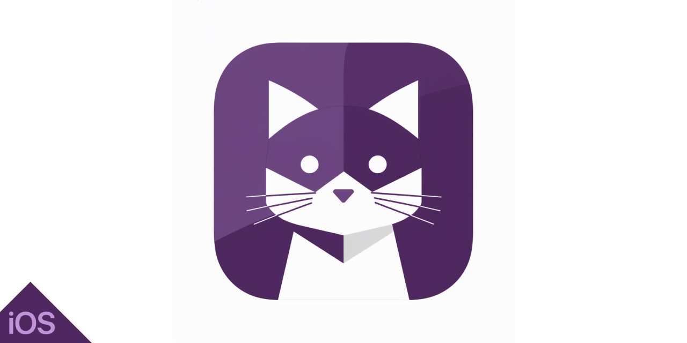

# Snapcat

Snapcat is a SwiftUI app showcasing the Cat as a Service (CaaS) API. It highlights iOS development skills, including API integration, SwiftUI, state management, Unit Testing and UI Testing. Snapcat uses a modular architecture, clean code principles, and the MVVM pattern with Combine for reactive programming.

## Setup Instructions

To run the project, follow these steps:

- Open Snapcat.xcodeproj
- Instal dependencies: Swift Package Manager (SPM) will automatically resolve and install the necessary dependencies when you open the project in Xcode. Ensure you have a stable internet connection.
- Select the target device: In Xcode, select a simulator or a physical device that runs iOS 17.0 or later. The minimum iOS version required to support all features of the app is 17.0.
- Finally, Press the Run button (or Cmd + R) to build and run the project on the selected simulator or device.

## About the Cataas API

Cataas (Cat as a Service) is an API that provides a variety of cat images and gifs for use in your applications. Whether you need a random cat picture, a specific type of cat, or a customized cat image with text, the Cataas API has got you covered.

Features
Random Cat Images: Fetch random cat images with a simple API call.
Cat Gifs: Retrieve animated cat gifs to bring some joy to your app.
Tagged Cats: Get cat images based on specific tags (e.g., "cute", "sleepy", "angry").
Customizable Images: Create custom cat images with text and filters to suit your needs.
Fast and Reliable: The API is designed to be fast and reliable, ensuring quick responses and high availability.

For more details, check out the official Cat as a Service website:

- [Cat as a Service](https://cataas.com)

## Dependencies

This project uses the following Swift Package Manager (SPM) dependencies:

- [SDWebImageSwiftUI](https://github.com/SDWebImage/SDWebImageSwiftUI.git)
- [Nimble](https://github.com/Quick/Nimble.git)
- [Quick](https://github.com/Quick/Quick.git)
- [Realm](https://github.com/realm/realm-swift.git)